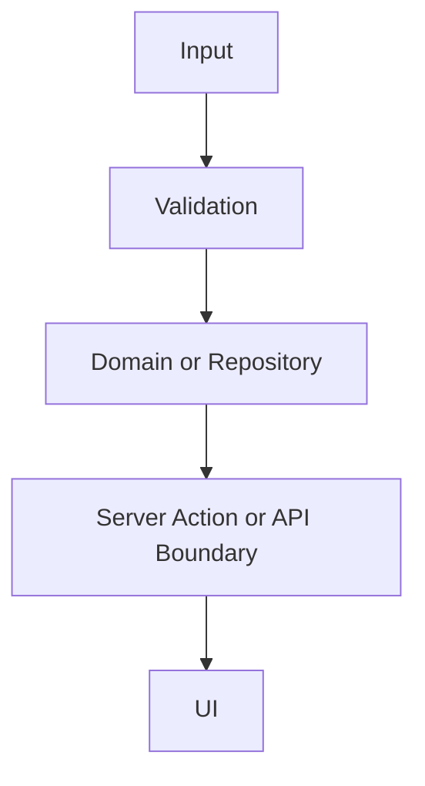

# Architecture Boundary Document Shape

Use this shape when the repository does not already define a stronger architecture boundary document format.

Replace every example or placeholder row with observed repository evidence. If a section has no observed evidence, omit that section or mark it as an open question instead of leaving template examples in the output.

## Purpose

- What this document governs.
- Which codebase, package, or app area is in scope.
- Which source-of-truth files were used.

## Boundary Tree

```text
repo/
  app-or-entrypoint/     -> request, route, action, or UI boundary
  features/<feature>/    -> feature-owned use cases and repositories
  lib/                   -> cross-feature contracts and helpers
  components/            -> shared UI building blocks
  schemas/               -> validation and parsing contracts
```

Replace the example with the repository's observed structure. Do not add layers that are not present in code.

## Boundary Responsibility Table

| Boundary        | Owns           | May Depend On             | Must Not Own             | Evidence      |
| --------------- | -------------- | ------------------------- | ------------------------ | ------------- |
| `path/or/layer` | Responsibility | Allowed imports or inputs | Forbidden responsibility | Files or docs |

## Public Type / Interface Table

| Type or Interface | Defined In | Consumers | Contract Role                                          | Notes              |
| ----------------- | ---------- | --------- | ------------------------------------------------------ | ------------------ |
| `TypeName`        | `path`     | `path(s)` | Input, output, DTO, action result, schema, props, etc. | Stability or drift |

## Data Flow

Describe the happy path as a compact numbered flow or Mermaid diagram. Include validation, transformation, repository/domain calls, external boundaries, and UI consumption.



## Error Flow

Capture how failures move between layers.

| Source            | Failure Shape                        | Boundary Conversion            | User-Facing Owner             | Evidence |
| ----------------- | ------------------------------------ | ------------------------------ | ----------------------------- | -------- |
| Repository/domain | Result, typed error, exception, etc. | Action/API mapping or fallback | Component/messages/docs owner | Files    |

Document expected failures separately from unexpected exceptions.

## Side Effects and External Boundaries

| Side Effect                                         | Boundary Owner | Called From | Retry/Fallback Behavior | Evidence |
| --------------------------------------------------- | -------------- | ----------- | ----------------------- | -------- |
| Database, API, file, queue, auth, mail, cache, etc. | Layer/path     | Caller      | Observed behavior       | Files    |

## Dependency Direction Rules

- Allowed import direction.
- Shared helper placement rules.
- Cross-feature access rules.
- External integration access rules.

Tie each rule to existing code or repo guidance. Mark proposed rules as recommendations, not facts.

## Verification Map

| Boundary or Flow | Verification Command | Test/File Coverage | Exit Status or Expected Gate |
| ---------------- | -------------------- | ------------------ | ---------------------------- |
| Area             | `command`            | `path`             | Required result              |

## Forbidden Crossings

| Crossing                      | Why It Is Forbidden | Safer Route                      | Evidence     |
| ----------------------------- | ------------------- | -------------------------------- | ------------ |
| Example import or direct call | Boundary violation  | Allowed helper/action/repository | Docs or code |

## Open Questions / Drift Risks

- Unknown boundary ownership.
- Conflicting docs or implementation.
- Missing tests or verification gates.
- Areas where code suggests a rule but docs do not confirm it.
